#NAS Portal

---

## Inhalt

- [Einfuehrung](#einfuehrung)
- [Funktionen](#funktionen)
- [Admin-Bereich](#admin-bereich)
  - [Sektionen und Dienste verwalten](#sektionen-und-dienste-verwalten)
  - [Theme auswaehlen](#theme-auswaehlen)
  - [Konfiguration bearbeiten](#konfiguration-bearbeiten)
  - [Passwort aendern](#passwort-aendern)
- [Manuelle Konfiguration](#manuelle-konfiguration)
- [Theming](#theming)
- [Verzeichnisstruktur (relevante Teile)](#verzeichnisstruktur-relevante-teile)
- [Installation](#installation)
  - [Installation: Docker (empfohlen)](#installation-docker-empfohlen)
    - [Voraussetzungen](#voraussetzungen)
    - [Schnellstart](#schnellstart)
  - [Installation: Standalone](#installation-standalone)
    - [Voraussetzungen](#voraussetzungen-1)
    - [Schritte (Uebersicht)](#schritte-uebersicht)
- [Hinweise](#hinweise)
- [Screenshots](#screenshots)
  - [Mobile Dashboard-Uebersicht](#mobile-dashboard-uebersicht)
  - [Mobile Dashboard-Sektion](#mobile-dashboard-sektion)
  - [Mobile Info-Drawer](#mobile-info-drawer)
  - [Desktop Dashboard-Uebersicht](#desktop-dashboard-uebersicht)
  - [Desktop Dashboard-Sektion](#desktop-dashboard-sektion)
  - [Desktop Info-Drawer](#desktop-info-drawer)
  - [Theme 1984](#theme-1984)
  - [Theme Bubbles](#theme-bubbles)
  - [Theme Classic](#theme-classic)
  - [Theme Compact List](#theme-compact-list)
  - [Theme Console](#theme-console)
  - [Theme Hacker](#theme-hacker)
  - [Theme Hippies](#theme-hippies)
  - [Theme Waaaah-Waaah-Waaaaaah](#theme-waaaah-waaah-waaaaaah)
- [Lizenz](#lizenz)
- [Hinweise zu Drittanbieter-Komponenten](#hinweise-zu-drittanbieter-komponenten)

---

## Einfuehrung

Wer kennt es nicht? Du hast deine NAS erfolgreich aufgebaut und sie um etliche extra Services ergänzt. Gleichzeitig liegen in deinem Netzwerk vielleicht noch weitere Dienste vor, die du allesamt über ein Webfrontend öffnen und verwalten kannst, und sie sind natürlich alle mit ihrer eigenen URL konfiguriert. Dieses Dashboard soll dir helfen, alle Dienste zu sammeln und kategorisiert aufzulisten.

Zusätzlich bietet dir der integrierte Info-Drawer eine schnelle Übersicht über den Gesamtzustand deiner OMV-NAS.

Dieses themebare Dashboard eignet sich auch sehr gut als dauerhaft sichtbares Interface auf Bildschirmen, wie es im Smart-Home-Umfeld häufig eingesetzt wird.

Dieses Projekt wurde ursprünglich für meine mit [OpenMediaVault](https://www.openmediavault.org/) betriebene NAS entwickelt, bezog die Daten für den Info-Drawer über die zentrale API von OMV und trug damals noch den sperrigen Namen "OMV-Service-Dashboard".
Mittlerweile greift der Service für System-, Speicher-, Temperatur- und Plattforminformationen nicht mehr auf die OMV-API zurück, sondern liest diese Daten direkt über Systemdateien und Standardwerkzeuge wie `lsblk`, `smartctl`, `dmidecode`, `docker` und weitere Host-Abfragen aus. Dadurch ist das Portal nicht mehr auf OMV beschränkt und läuft grundsätzlich auch auf anderen NAS- oder Linux-Plattformen, sofern die benötigten Systemwerkzeuge dort verfügbar sind.

> **Hinweise**
>
> Die Kategorien werden hier nachfolgend als "Sektionen" und die darin konfigurierten Dienste als "Services" bezeichnet.
>
> Alle dauerhaft gespeicherten Änderungen aus dem Admin-Bereich werden in das Benutzer-Config-Verzeichnis geschrieben.
>
> Im Docker-Betrieb ist das innerhalb des Containers standardmäßig `/config` und sollte in der Regel per Host-Volume gemountet werden.
>
> Im Standalone-Betrieb solltest du das Config-Verzeichnis normalerweise explizit per `--config-dir` übergeben. `OMV_SERVICE_DASHBOARD_CONFIG` dient dort nur als Fallback, wenn kein CLI-Parameter gesetzt ist.


---

## Funktionen

- Übersichtliches Dashboard mit Sektionen wie zum Beispiel `System`, `Media` oder `Smart Home`
- Service-Karten mit Links zu deinen konfigurierten Netzwerkdiensten
- Hintergrundbilder pro Sektion
- Live-Statistik-Drawer (Info-Drawer) mit Uptime, RAM, Datenträgern, Temperaturen und Docker-Containern
- Mehrsprachige Benutzeroberfläche
- Umschaltbare Frontend-Themes für das öffentliche Dashboard

---

## Admin-Bereich

Der Admin-Bereich ist in diese Unterbereiche gegliedert:

- Sektionen und Dienste verwalten
- Theme auswaehlen
- Konfiguration bearbeiten
- Passwort aendern

und hier erreichbar:

```text
{dashboard-url}/admin
```

Das Standard-Passwort ist:

```text
dashboard
```

---

### Sektionen und Dienste verwalten

Hier können Sektionen und Dienste angelegt, bearbeitet, sortiert und gelöscht werden. Außerdem lassen sich dort Namen, Links, Beschreibungen sowie die verwendeten Vorschaubilder und Hintergründe pflegen.

Für einige eingebaute Sektionen-IDs existieren bereits Grafiken. Wenn du diese nutzen möchtest, verwende diese IDs:

- `admin`
- `files`
- `kitchen`
- `media`
- `network`
- `smart-home`

Default-Bilder für Sektionen und Services können hier abgelegt werden:

```text
/config
└─ assets/
   ├─ backgrounds/
   │  ├─ _default.png
   │  └─ _home.png
   └─ cards/
      ├─ sections/
      │  └─ _default.png
      └─ services/
         └─ _default.png
```

Für hochgeladene Card-Bilder ist eine Größe von etwa `305px x 185px` empfehlenswert.

---

### Theme auswaehlen

Hier kann das aktive öffentliche Theme ausgewählt werden. Aufgelistet werden sowohl die integrierten Themes als auch zusätzlich im User-Config-Verzeichnis unter `/config/assets/themes` abgelegte Themes.

---

### Konfiguration bearbeiten

Hier können die wichtigsten Konfigurationswerte bearbeitet werden, zum Beispiel:

- `Titel`: Basistitel und Seitenüberschrift des Dashboards
- `Fallback-Sprache`: Standardsprache, wenn keine passende Locale gefunden wird
- `Info-Drawer-Refresh-Intervall`: Aktualisierungsintervall des Info-Drawers in Sekunden
- `Port`: Port, auf dem die Anwendung lauscht

---

### Passwort aendern

Hier kann das Admin-Passwort geändert werden.

---

## Manuelle Konfiguration

Die Konfigurationsdaten werden in `/config/config.json` und `/config/services.json` abgelegt und können bei Bedarf auch manuell bearbeitet werden.

Im Normalfall erfolgen Änderungen über den Admin-Bereich und werden dort automatisch gespeichert. Direktes Bearbeiten der Dateien ist vor allem dann sinnvoll, wenn man sich im Backend kaputtkonfiguriert hat.

Bitte lies [`CONFIG_README.de.md`](./CONFIG_README.de.md), um mehr über die manuelle Konfiguration zu erfahren.

---

## Theming

Das öffentliche Dashboard unterstützt umschaltbare Themes. Das aktive Theme wird in der `config.json` gespeichert und kann auch im Backend ausgewählt werden.

Beispiel:

```json
{
  "theme": "classic"
}
```

Eigene Themes können unter folgendem Pfad abgelegt werden:

```text
/config/assets/themes/<theme-id>/
```

Ein vollständiges Beispiel-Theme mit `meta.json`, `theme.css`, `drawer.css` und `theme.js` liegt unter [`config.example/assets/themes/sunrise`](./config.example/assets/themes/sunrise/).

Jedes Theme-Verzeichnis sollte mindestens diese Dateien enthalten:

```text
meta.json
theme.css
drawer.css
```

Themes können optional auch ein clientseitiges Skript mitbringen:

```text
theme.js
```

Wenn für das aktive Theme eine Datei unter `/assets/themes/<theme-id>/theme.js` existiert, wird sie vom Frontend automatisch geladen.

Konvention für Theme-Skripte:

- Genau ein globales Objekt unter `window.OMVTheme` registrieren
- Eine Funktion `init(context)` bereitstellen
- Optional eine Funktion `destroy()` für Cleanup bereitstellen
- Theme-spezifisches DOM und Verhalten im Theme-Ordner halten statt gemeinsame Core-Skripte zu verändern

Der an `init()` übergebene `context` enthält:

- `theme`
- `body`
- `document`
- `drawer`
- `version`

Eigene Themes können dort auch eine bestehende eingebaute Theme-ID übernehmen und so ein System-Theme aus `/config/assets/themes` heraus überschreiben.

Die technischen Details, die Ordnerstruktur, die Style-Vererbung und das Überschreiben eingebauter Themes sind in [`CONFIG_README.de.md`](./CONFIG_README.de.md) dokumentiert.
Theme-Vorschauen findest du weiter unten ab [Theme 1984](#theme-1984).

---

## Verzeichnisstruktur (relevante Teile)

```text
app/
  server.js           # Node/Express-Server
  lib/                # Backend-Helfer (i18n, Assets, Stats, Config-Loader)
  templates/          # HTML-Templates
  default-data/       # wird zur Laufzeit nach /data kopiert
    assets/           # integrierte Assets (JS, CSS, Bilder)
    i18n/             # integrierte Übersetzungen
config.example/       # Beispielkonfiguration
```

Benutzerdefinierte Konfigurationen und Assets liegen außerhalb des App-Codes:

```text
/config               # Benutzerkonfiguration (gemountetes Volume)
```

---

## Installation

Die Anwendung ist dafür ausgelegt, entweder:

- in einem Docker-Container (empfohlen)
- direkt auf dem OMV-Host (standalone)

---

### Installation: Docker (empfohlen)

#### Voraussetzungen

- Docker
- Docker Compose oder `docker compose`

---

#### Schnellstart

Siehe [`example.docker-compose.yml`](./example.docker-compose.yml).

Das Image liegt hier: 

`ghcr.io/robnice/omv-service-dashboard:latest`

1. Wenn du vor dem ersten Start bereits eine eigene Konfiguration vorbereiten möchtest, kopiere die Beispielkonfiguration:

```bash
cp -r config.example path-to-your-config-directory
```

Du musst die Konfigurationsdatei nicht zwingend kopieren, da sie beim ersten Start automatisch erstellt wird, falls sie noch nicht existiert.

2. Mappe dein Host-Config-Verzeichnis im Compose-File nach `/config`.

Alle dauerhaft gespeicherten Änderungen aus dem Admin-Bereich landen dort.

`OMV_SERVICE_DASHBOARD_CONFIG` musst du im Docker-Betrieb normalerweise nicht setzen, weil `/config` im Container bereits der Standardpfad ist.

3. Starte den Container:

```bash
docker compose up -d
```

4. Öffne das Dashboard im Browser:

```text
http://<host>:<port>/
```

Updates und Neuaufsetzen des Containers sind jederzeit möglich. Alles innerhalb von `/config` bleibt erhalten.

---

### Installation: Standalone

---

#### Voraussetzungen

- Node.js v18+ oder v20+
- npm
- OpenMediaVault-Host

---

#### Schritte

1. Repository klonen.
2. Abhängigkeiten installieren:

```bash
cd app
npm install
```

3. Ein Konfigurationsverzeichnis vorbereiten. Du kannst entweder die Beispielkonfiguration kopieren oder mit einem leeren Verzeichnis starten:

```bash
cp -r ../config.example /pfad/zu/deinem-nas-portal-config
```

4. Den Server aus dem Verzeichnis `app/` starten und das Config-Verzeichnis explizit übergeben:

```bash
node server.js --config-dir /pfad/zu/deinem-nas-portal-config
```

`--config-dir` ist für den Standalone-Betrieb die bevorzugte Variante.

#### Priorität für das Config-Verzeichnis

Die Anwendung ermittelt das Benutzer-Config-Verzeichnis in dieser Reihenfolge:

1. `--config-dir /pfad/zum/config-verzeichnis`
2. `OMV_SERVICE_DASHBOARD_CONFIG=/pfad/zum/config-verzeichnis`
3. Standardpfad: `app/config`

Wenn weder CLI-Parameter noch Umgebungsvariable gesetzt sind, startet der Server mit dem Standardpfad und gibt beim Start einen Hinweis aus.

#### Hinweise für den Standalone-Betrieb

- Laufzeitdaten landen standardmäßig in `app/data`.
- Benutzerkonfigurationen landen standardmäßig in `app/config`.
- Alle dauerhaft gespeicherten Änderungen aus dem Admin-Bereich werden in das gewählte Config-Verzeichnis geschrieben.
- `OMV_SERVICE_DASHBOARD_CONFIG` ist vor allem für skriptgesteuerte oder umgebungsbasierte Standalone-Setups sinnvoll.

---

## Hinweise

- Das öffentliche Dashboard kann über `/config/assets/themes` gethemed werden.
- Der Admin-Bereich behält bewusst sein eigenes Styling und wird nicht gethemed.
- Übersetzungen aus `/config/i18n` werden über die integrierten Übersetzungen gelegt.

---

## Screenshots

---

### Mobile Dashboard-Uebersicht

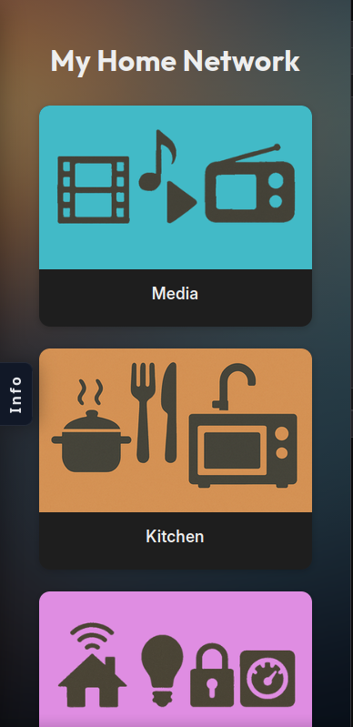

---

### Mobile Dashboard-Sektion

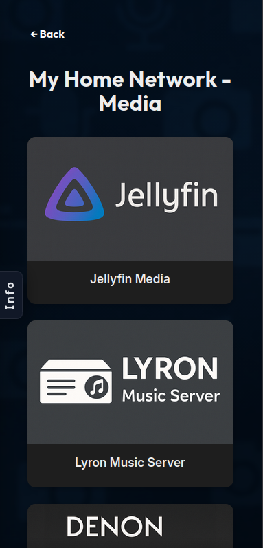

---

### Mobile Info-Drawer

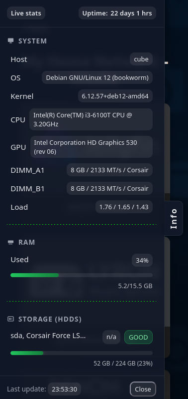

---

### Desktop Dashboard-Uebersicht

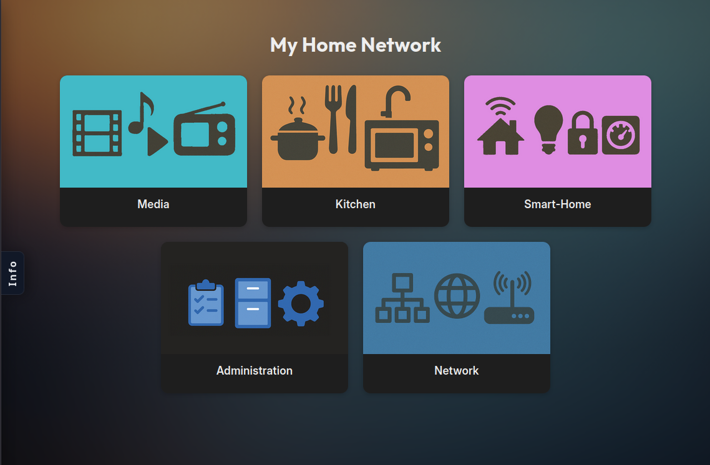

---

### Desktop Dashboard-Sektion

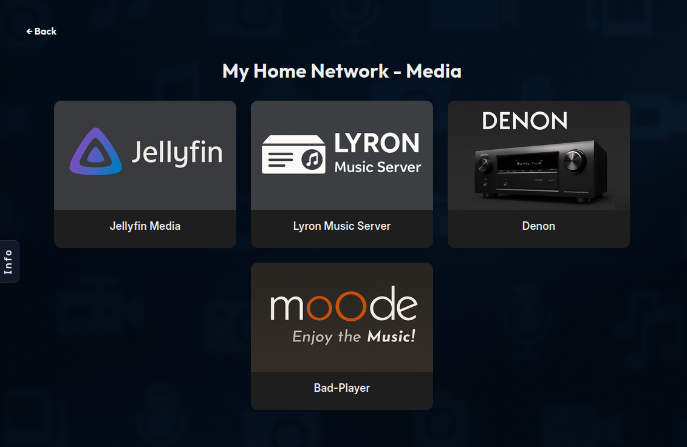

---

### Desktop Info-Drawer

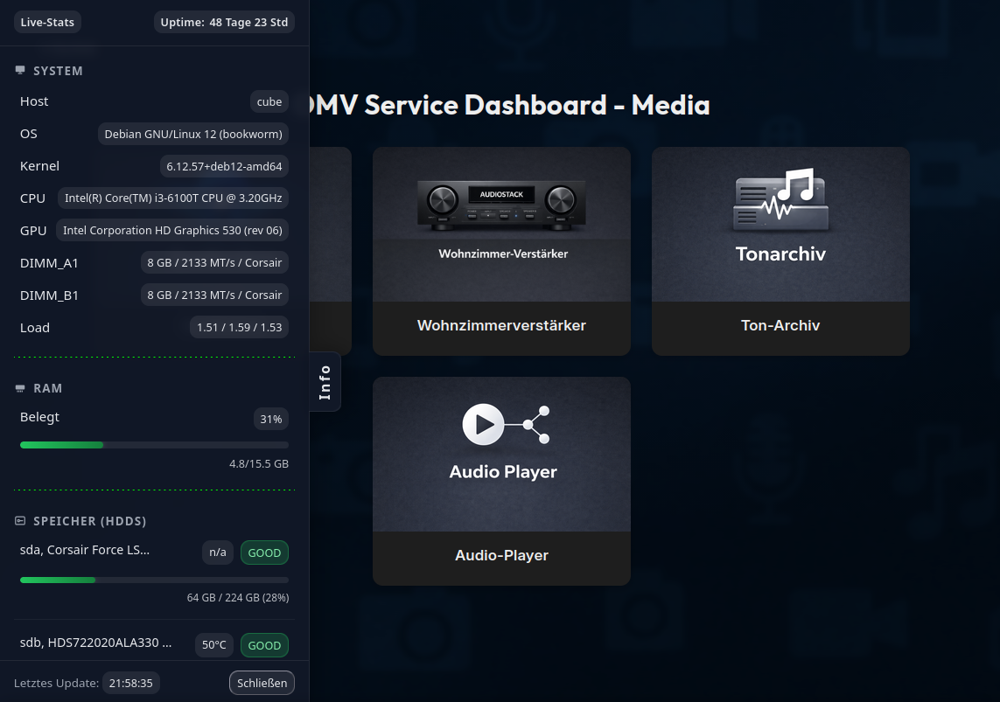

---

### Theme 1984

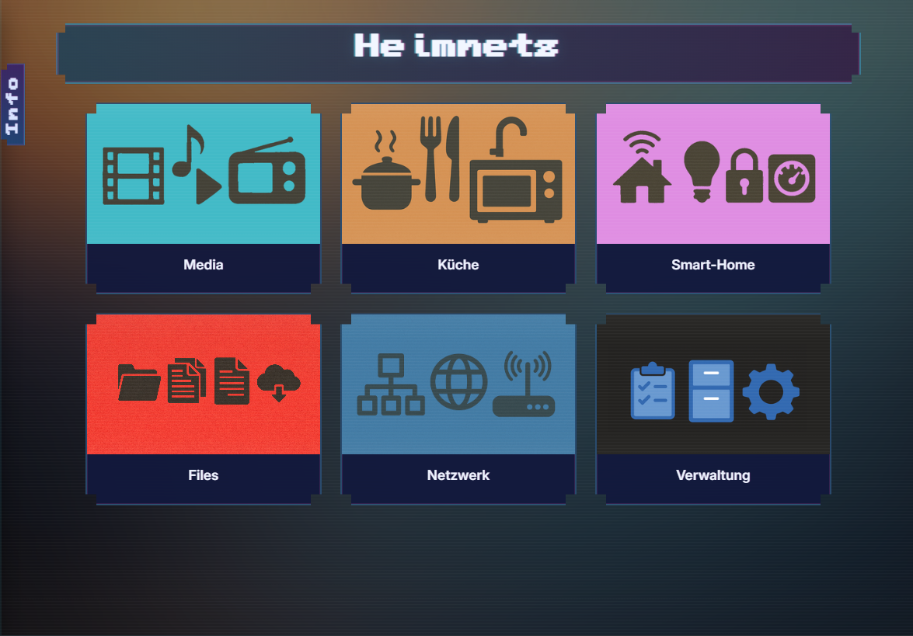

---

### Theme Bubbles

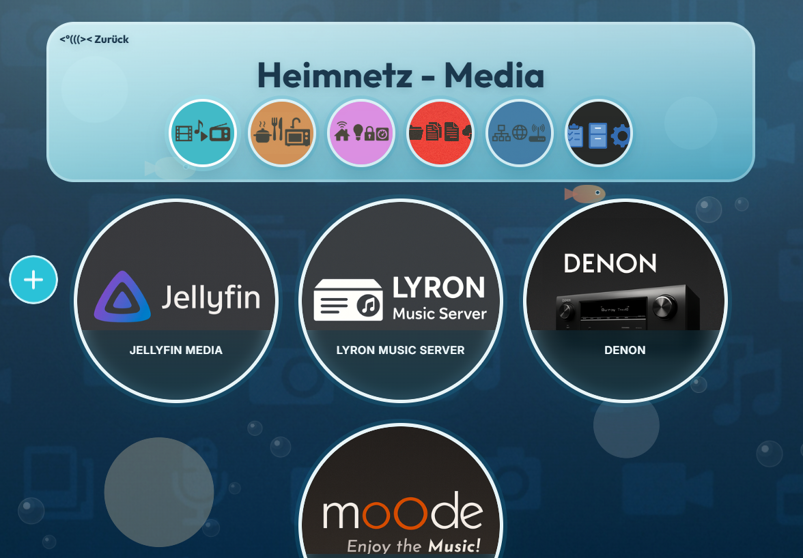

---

### Theme Classic

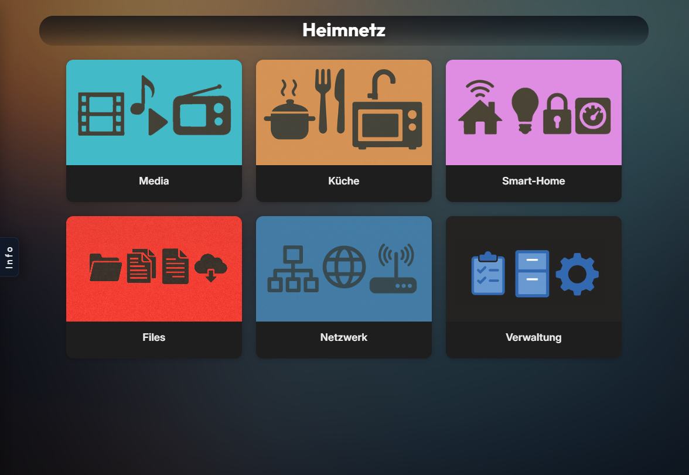

---

### Theme Compact List

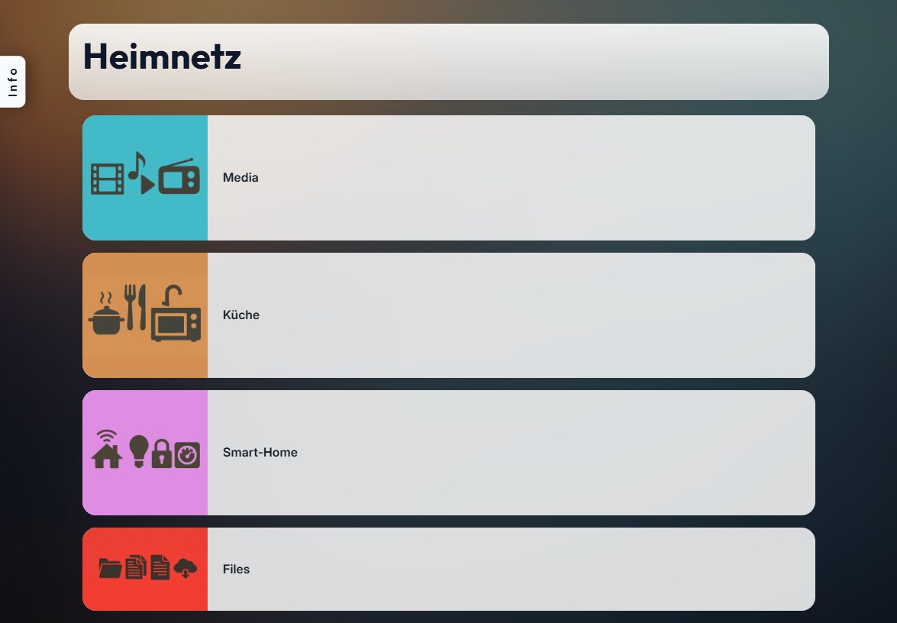

---

### Theme Console

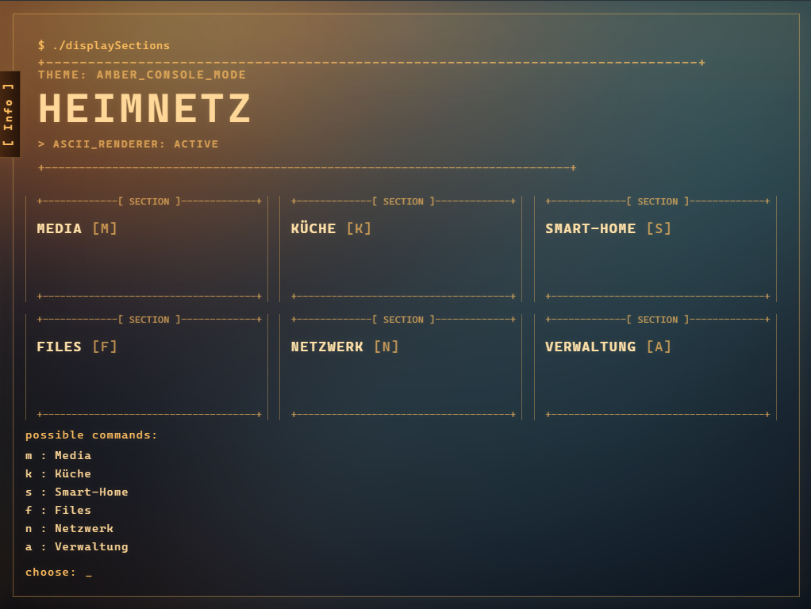

---

### Theme Hacker

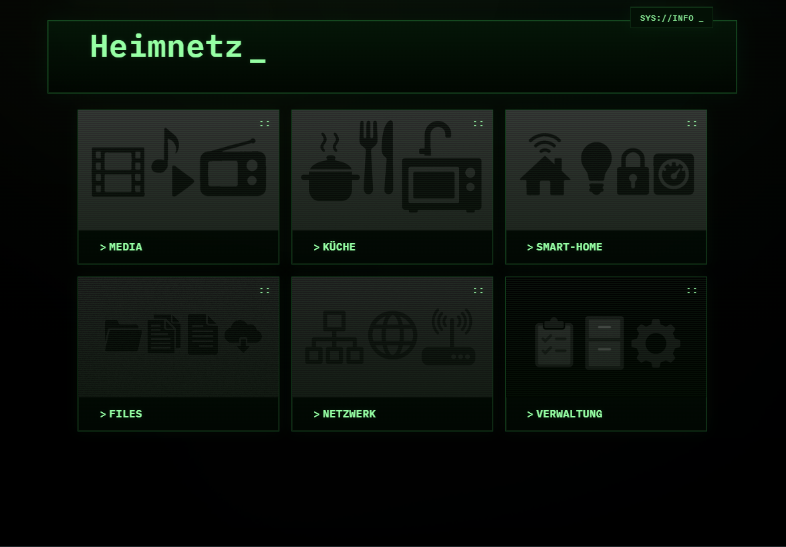

---

### Theme Hippies

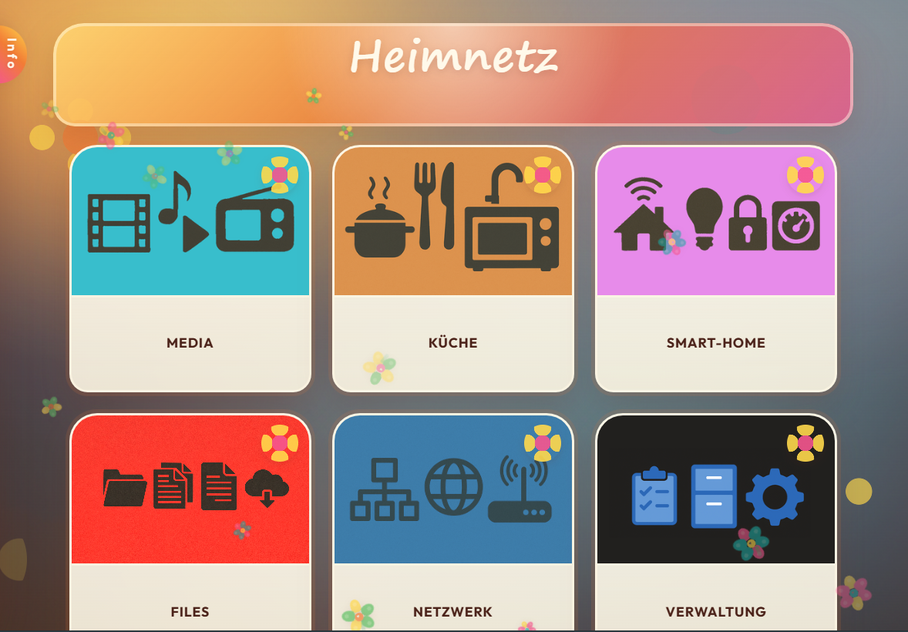

---

### Theme Waaaah-Waaah-Waaaaaah

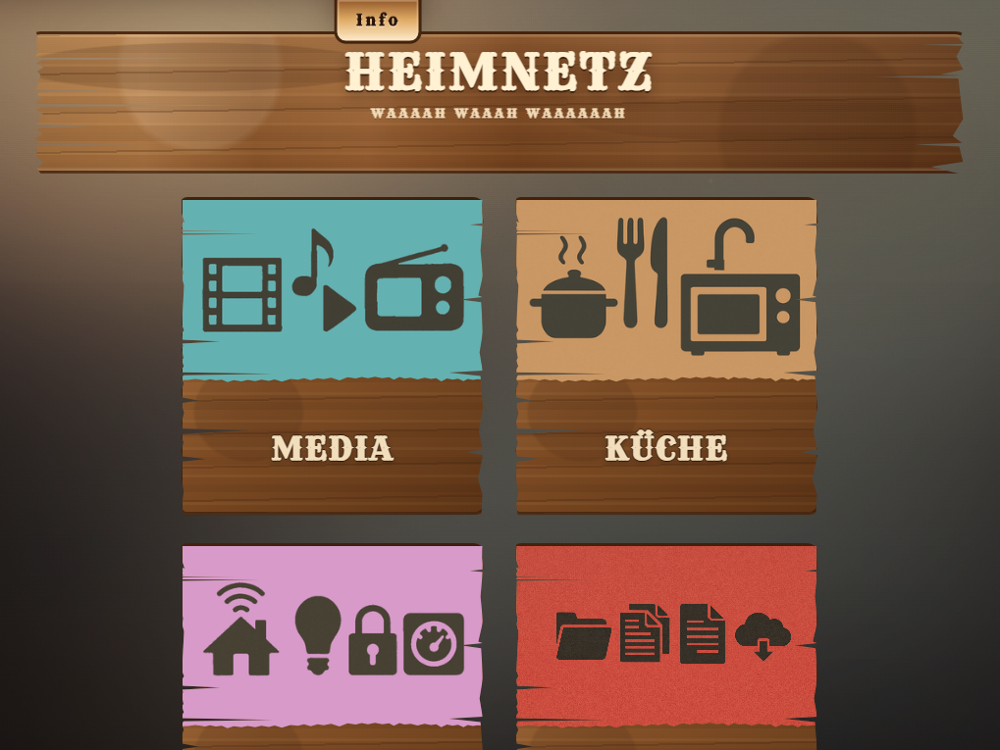

---

## Lizenz

[`MIT`](./LICENSE)

---

## Hinweise zu Drittanbieter-Komponenten

[`THIRD_PARTY_NOTICES.md`](./THIRD_PARTY_NOTICES.md)
