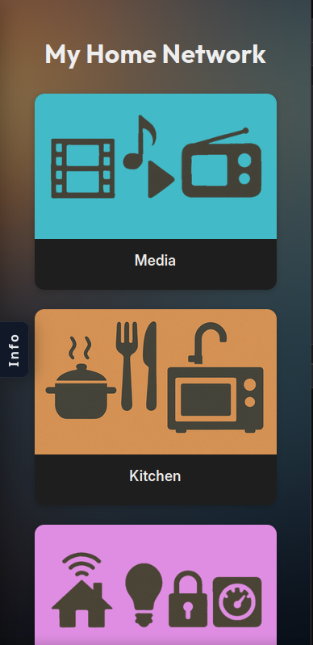
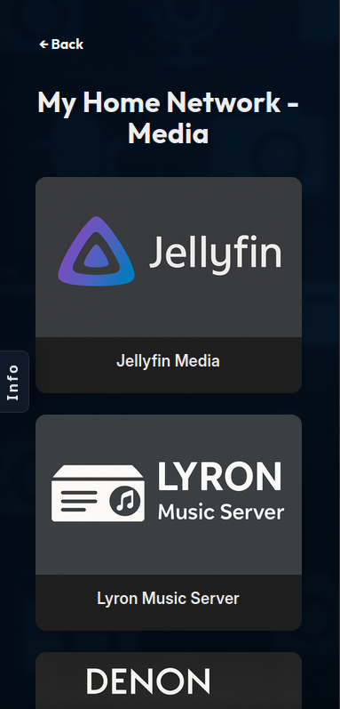
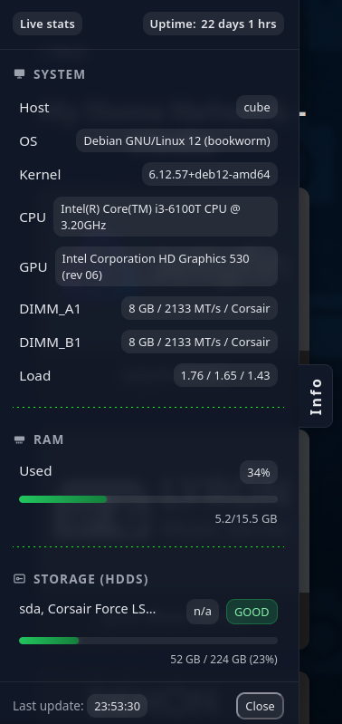
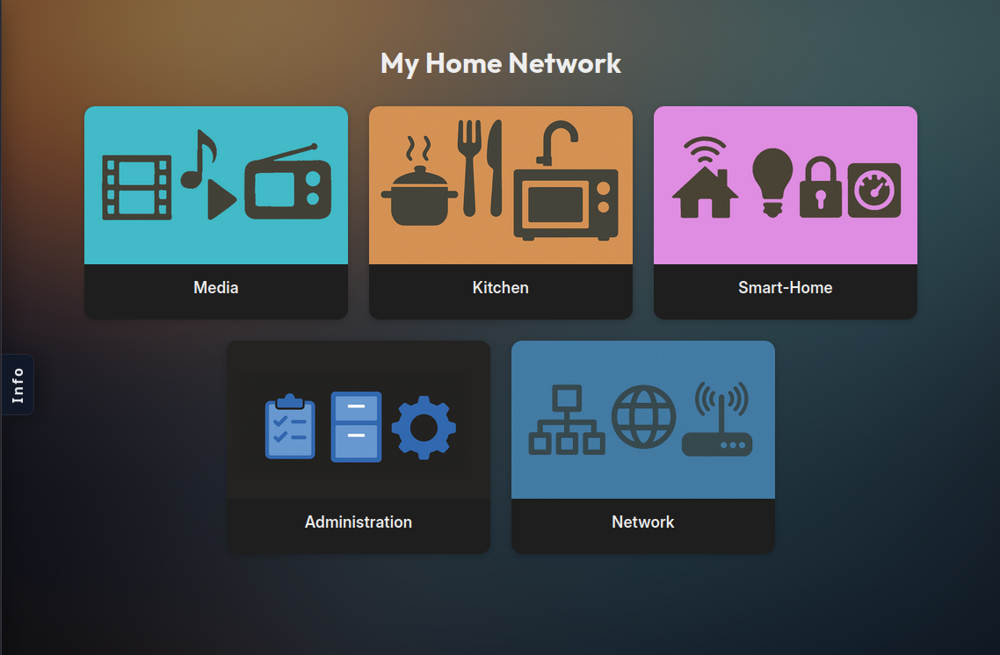
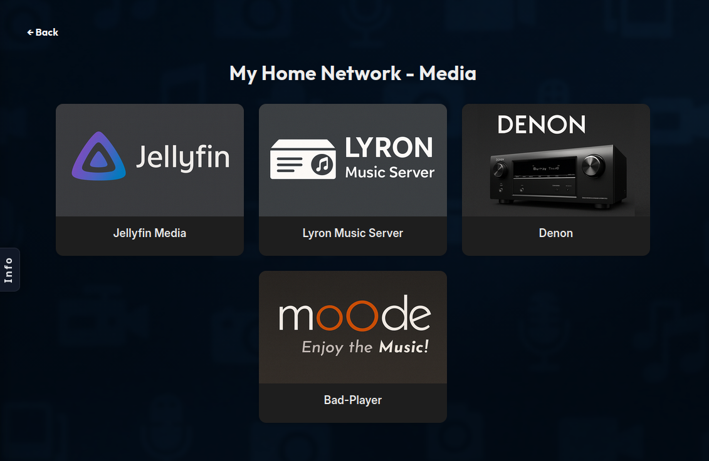
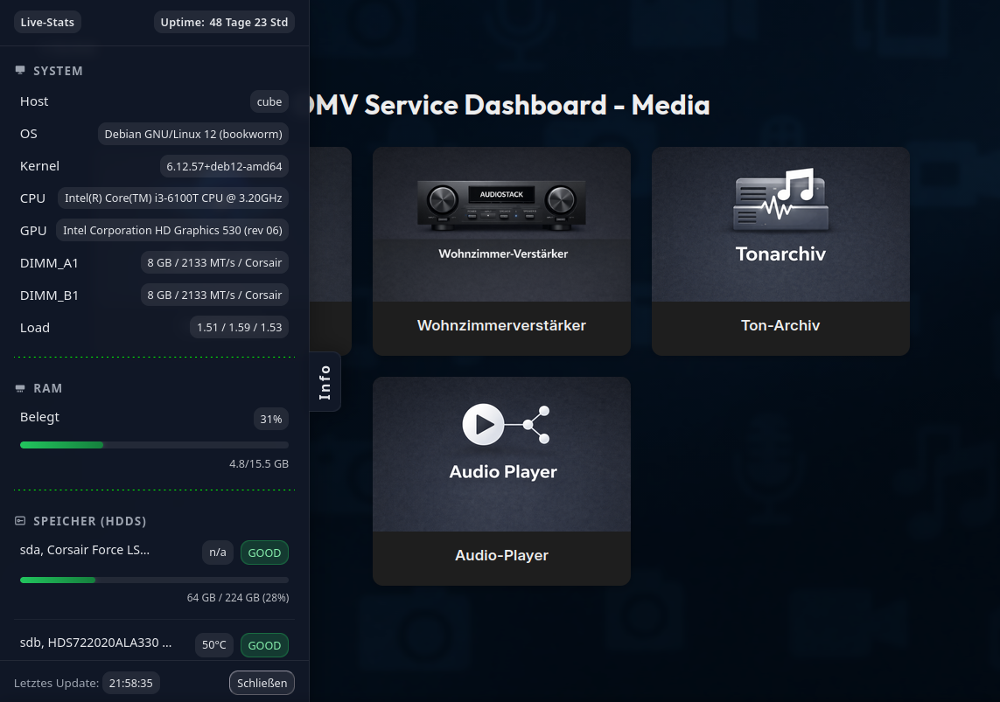

# OMV Service Dashboard

---

## Table of Contents

- [Introduction](#introduction)
- [Features](#features)
- [Configuration (important)](#configuration-important)
- [Directory Structure (relevant parts)](#directory-structure-relevant-parts)
- [Installation](#installation)
  - [Installation: Docker (recommended)](#installation-docker-recommended)
      - [Requirements](#requirements)
      - [Quick Start](#quick-start)
  - [Installation: Standalone (advanced / untested)](#installation-standalone-advanced--untested)
      - [Requirements](#requirements-1)
      - [Steps (overview)](#steps-overview)
- [Notes](#notes)
- [Screenshots](#screenshots)
    - [Mobile dashboard overview](#mobile-dashboard-overview)
    - [Mobile dashboard section](#mobile-dashboard-section)
    - [Mobile info drawer](#mobile-info-drawer)
    - [Desktop dashboard overview](#desktop-dashboard-overview)
    - [Desktop dashboard section](#desktop-dashboard-section)
    - [Desktop info drawer](#desktop-info-drawer)
- [License](#license)

---

## Introduction / What is this for?

The OMV Service Dashboard primarily serves as a central, clear web interface for
displaying and accessing services and system information around an OpenMediaVault server.

In addition, the dashboard is very well suited as a permanently visible interface on
screens, as commonly used in smart home environments.

---

## Features

- Clear dashboard with sections (e.g. *System*, *Media*, *Smart Home*, …)
- Service cards with links to OMV, Home Assistant, Mealie, Jellyfin, etc.
- Background images per section
- Preview images per section and service
- Live statistics drawer (uptime, RAM, disks, temperatures, Docker containers)
- Docker integration (container list, basic status, update information)
- Multilingual user interface (labels, drawer texts, etc.)

---

## Configuration

Page structure, configuration, translations, and custom images are defined via the admin area and configuration files.

The configuration files are located in a dedicated
`/config` directory, which is read at runtime and safely survives updates and container rebuilds.

➡️ **Please read [`CONFIG_README.md`](./CONFIG_README.md) for details.**

This README intentionally keeps configuration details short to avoid redundancy.

The actual structure of your portal page is configured in the admin area of the OMV web interface.

## Admin Area

Configuration of sections and services is done via an integrated admin area, accessible at:
> {dashboard-url}/admin

The default password is
> dashboard


> ⚠️ The `services.json` no longer needs to be edited manually.
Changes are made via the web interface. The file now only serves as a persistent data store.

Graphics (card and background images) already exist for certain sections. If you want to use them, use the following section IDs:
- admin
- files
- kitchen
- media
- network
- smart-home

Default images for sections and services can be placed here if needed:

```
/config
 └─ assets/
     ├─ backgrounds/
     │   ├─ _default.png
     │   └─ _home.png (home screen background)
     └─ cards/
         ├─ sections/
         │   └─ _default.png 
         └─ services/
              └─ _default.png
```

For uploaded card images, a size of approximately `305px × 185px` is recommended.

---


---

## Directory Structure (relevant parts)

```text
app/
  server.js           # Node/Express server
  lib/                # Backend helpers (i18n, assets, stats, config loader)
  templates/          # HTML templates
  default-data/       # copied to /data at runtime
    assets/           # Integrated assets (JS, CSS, images)
    i18n/             # Integrated translations
config.example/       # Example configuration
```

Custom configurations and assets are located outside the app code in:

```text
/config               # User configuration (mounted volume)
```

---
## Installation

The application is designed to run either

- in a Docker container (recommended) or
- directly on the OMV host (“standalone”)


### Installation: Docker (recommended)


#### Requirements

- Docker
- Docker Compose (or `docker compose`)

#### Quick Start

See the file [`example.docker-compose.yml`](./example.docker-compose.yml).

1. Only if you need to change anything before your first start, copy example configuration :

```bash
cp -r config.example path-to-your-config-directory
```

But you don't have to copy the config file as it will be created automatically when the service starts.

Do not forget to map the config directory to the config volume in the Docker Compose file.

2. Start container:

```bash
docker compose up -d
```

3. Open the dashboard in your browser:

```
http://<host>:<port>/
```

Updates or rebuilding the container are possible at any time –  
everything inside `/config` remains intact.

---

### Installation: Standalone (advanced / untested)

> ⚠️ This mode is currently not actively tested and mainly exists for completeness.

#### Requirements

- Node.js (v18+ or v20+ recommended)
- npm
- OpenMediaVault host

#### Steps (overview)

1. Clone repository
2. Install dependencies
3. Copy `config.example/` to `config/`
4. Start server with `node server.js`

---

### Notes

- JavaScript and CSS are part of the application core and **not customizable**.
- Visual customization is limited to backgrounds and card images.
- Translations from `/config/i18n` override the integrated translations.

---

## Screenshots

### Mobile dashboard overview

### Mobile dashboard section

### Mobile info drawer


### Desktop dashboard overview

### Desktop dashboard section

### Desktop info drawer


---

## License

[`MIT`](./LICENSE)
